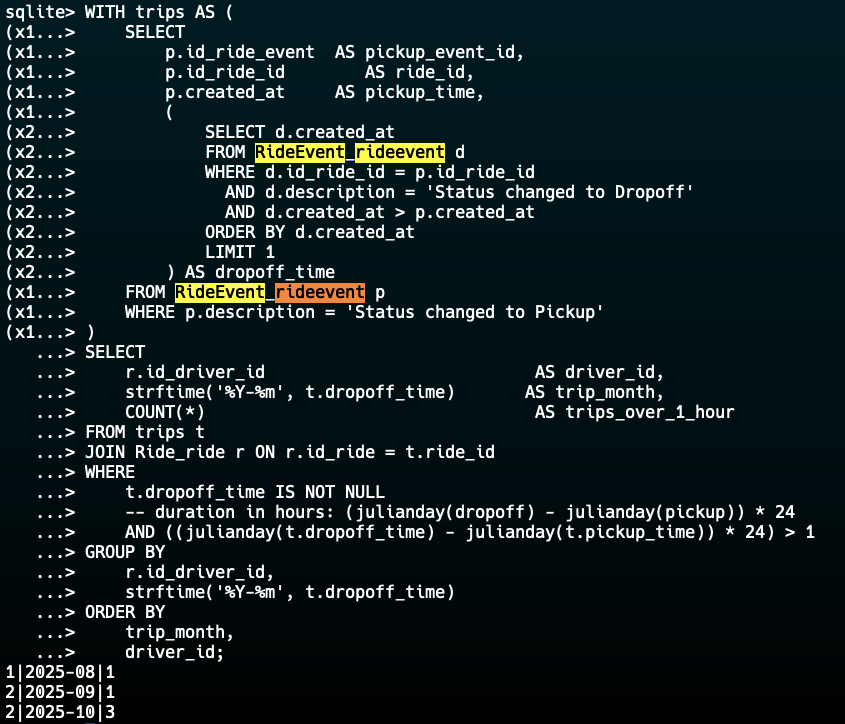

# 🚗 Django Ride Management API

A high-performance **Ride Management System** built using **Django REST Framework (DRF)**.  
This project demonstrates advanced API design, efficient ORM usage, and secure authentication — optimized for scalability and clarity.

---

## ✨ Features Overview

### 🧱 1. Django REST Framework Integration
- ✅ Created models for:
  - `Ride`
  - `User`
  - `RideEvent`
- ✅ Implemented serializers for JSON serialization and deserialization.
- ✅ Used `ViewSets` for full CRUD operations.

---

### 🔐 2. Authentication
- ✅ Implemented role-based authentication.
- ✅ Only users with the role **`admin`** can access the API endpoints.

---

### 🧭 3. Ride List API
The Ride List API provides a powerful and flexible interface for retrieving rides with related data.

#### ✅ Key Functionalities
- Returns a **list of rides** including:
  - Related **RideEvents**
  - Related **Users** (`id_rider`, `id_driver`)
- Supports:
  - **Pagination**
  - **Filtering**
    - By `ride_status`
    - By `rider_email`
  - **Sorting**
    - By `pickup_time`
    - By **distance** to a given GPS position (e.g., using `pickup_latitude` and `pickup_longitude`)
- Both sorting options are optimized for **large datasets** and maintain **pagination support**.

---

### ⚡ 4. Performance & Optimization
Designed with **large-scale data efficiency** in mind.

#### ✅ Key Optimizations
- Added computed field `todays_ride_events` on `Ride`, returning only events from the **last 24 hours**.
- Ensured **lazy loading** — the full list of `RideEvents` is **never** retrieved unnecessarily.
- Leveraged **Django ORM optimizations** such as:
  - `select_related` for related `User` models
  - `prefetch_related` with custom `Prefetch` filters for `RideEvents`
- 🚀 Achieved:
  - **2 SQL queries** to retrieve rides with related data  
  - **3 queries total** (including pagination count)

---

## 🧩 Technical Highlights

| Feature | Description |
|----------|-------------|
| **Framework** | Django REST Framework |
| **Authentication** | Role-based (Admin only) |
| **Pagination** | DRF’s built-in pagination |
| **Filtering** | Query parameter-based filtering |
| **Sorting** | Dynamic sort by `pickup_time` or distance |
| **Performance** | Optimized queryset with `select_related` & `prefetch_related` |
| **Scalability** | Designed for large tables with minimal SQL hits |

---

## 🧠 Example Query Parameters

| Parameter | Type | Description |
|------------|------|-------------|
| `status` | `string` | Filter rides by status |
| `rider_email` | `string` | Filter rides by rider email |
| `order` | `string` | Choose `pickup_time` or `distance` |
| `latitude` | `float` | Used for distance-based sorting (needed for sorting with `distance`) |
| `longitude` | `float` | Used for distance-based sorting (needed for sorting with `distance`) |
| `page` | `int` | Paginate results |

Example:
GET /api/rides/?status=pickup&rider_email=john@example.com&latitude=14.609053&longitude=121.022256&order=-distance

---

## 🧰 Setup Instructions

### Clone repository
git clone https://github.com/Eieyron/DjangoRidesAPI.git
cd DjangoRidesAPI

### Create virtual environment
python -m venv venv
source venv/bin/activate  # or venv\Scripts\activate (Windows)

### Install dependencies
pip install -r requirements.txt

### Run migrations
python manage.py migrate

### Create superuser (admin)
python manage.py createsuperuser

### Run server
python manage.py runserver

---

## Tech Stack

Python 3.12+
Django 5.x
Django REST Framework
SQLite / PostgreSQL
Django Session Authentication

---

## 🏁 Summary
| Goal                           | Status      |
| ------------------------------ | ----------- |
| Models & Serializers           | ✅ Completed |
| CRUD via ViewSets              | ✅ Completed |
| Admin Authentication           | ✅ Completed |
| Ride List API                  | ✅ Completed |
| Filtering, Sorting, Pagination | ✅ Completed |
| Performance Optimizations      | ✅ Completed |

---

## SQL Challenge
We want a monthly count of trips (per driver) that took more than 1 hour from pickup to dropoff, where:
“pickup” = event with description = 'Status changed to Pickup'
“dropoff” = event with description = 'Status changed to Dropoff'
Duration = time difference between the pickup and dropoff events.

### For SQLITE3
WITH trips AS (
    SELECT
        p.id_ride_event  AS pickup_event_id,
        p.id_ride_id        AS ride_id,
        p.created_at     AS pickup_time,
        (
            SELECT d.created_at
            FROM RideEvent_rideevent d
            WHERE d.id_ride_id = p.id_ride_id
              AND d.description = 'Status changed to Dropoff'
              AND d.created_at > p.created_at
            ORDER BY d.created_at
            LIMIT 1
        ) AS dropoff_time
    FROM RideEvent_rideevent p
    WHERE p.description = 'Status changed to Pickup'
)
SELECT
    r.id_driver_id                           AS driver_id,
    strftime('%Y-%m', t.dropoff_time)       AS trip_month,
    COUNT(*)                                 AS trips_over_1_hour
FROM trips t
JOIN Ride_ride r ON r.id_ride = t.ride_id
WHERE
    t.dropoff_time IS NOT NULL
    -- duration in hours: (julianday(dropoff) - julianday(pickup)) * 24
    AND ((julianday(t.dropoff_time) - julianday(t.pickup_time)) * 24) > 1
GROUP BY
    r.id_driver_id,
    strftime('%Y-%m', t.dropoff_time)
ORDER BY
    trip_month,
    driver_id;

### Explanation
- For this, what I did was I created a temporary table called `trips` with a query that lists all the trips with the same ride events
- then from that trips table, i joined it with the `ride` table
- after joining, I only took the trip with more than 1hr (based on julianday computation)
- then grouped it by the month of the trip and the driver id

#### if PostgreSQL
I will be using a different way to compute the time duration, but everything else is pretty much the same

### Output Screenshot

---

“Build APIs not just to function — but to scale gracefully.” 🚀

Author: Aaron Magnaye
License: MIT
Repository: https://github.com/Eieyron/DjangoRidesAPI
